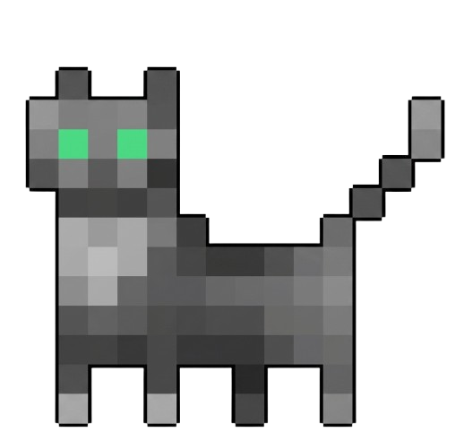

<p align="center">
  
</p>

<h1 align="center">Pedro's Adventure</h1>

<p align="center">
  A 2D tile-based platformer built with Python and Pygame<br/>
  Focused on game physics, collision systems, and grid-based level design
</p>

<p align="center">
  
  
  
</p>

---

## About the Project

**Pedro's Adventure** is a 2D platformer developed entirely in Python using Pygame.

Instead of relying on a full game engine, the project focuses on building core systems from scratch:
- tile-based world rendering
- collision detection
- movement physics
- camera system

The goal was to understand how platformers actually work under the hood.

---

## Gameplay

<p align="center">
  
</p>

<p align="center">
  
</p>

---

## Core Features

- Tile-based map system
- Player movement with gravity & jumping
- Custom AABB collision system
- Camera follow system
- Sprite animations
- Modular game loop architecture

---

## Tech Stack

- Python
- Pygame
- Custom tile engine logic
- Grid-based level design

---

##  How It Works

The game is structured around a classic game loop:

1. Input handling
2. Physics update
3. Collision resolution (tile-based)
4. State update (player/world)
5. Rendering pipeline

### Tile System

The world is built as a grid where each tile:
- has a fixed size
- may or may not be collidable
- is indexed for fast lookup

This makes collision detection efficient and predictable.

---

### Collision System

Collision is handled using **AABB (Axis-Aligned Bounding Boxes)**.

Movement is split into:
- horizontal resolution
- vertical resolution

This prevents common platformer bugs like:
- wall sticking
- corner glitches
- jittery jumps

---

## Challenges Faced

- Implementing stable collision without physics engines
- Handling edge cases in tile interactions
- Balancing movement speed vs precision
- Structuring a scalable codebase without overengineering it

---

## What I Learned

- How tile-based engines actually structure worlds
- Why game loops are the backbone of everything
- Why simple collision logic scales better than complex hacks
- Debugging physics is 50% logic, 50% suffering

---

## Running the Project

```bash
git clone https://github.com/dylancavalcante/pedros_adventure
cd pedros_adventure
pip install pygame
python main.py
